# What is a Proof?

## 

**Theorem 1.5.1**.  If $0≤x≤2$, then $-x^3+4x+1>0$.

---

**Proof.** Assume $0 \leq x \leq 2$. Then $x, 2-x$ and $2+x$ are all nonnegative. Therefore, the product of these terms is also nonnegative. Adding 1 to this product gives a positive number, so:
$$
x(2-x)(2+x)+1>0
$$
Multiplying out on the left side proves that
$$
-x^{3}+4 x+1>0
$$

## 

**Theorem 1.5.2.** If $r$ is irrational, then $\sqrt{r}$ is also irrational.

如果$r$是无理数,那么$\sqrt{r}$ 也是无理数。

---

**Proof.** We prove the contrapositive: if $\sqrt{r}$ is rational, then $r$ is rational. Assume that $\sqrt{r}$ is rational. Then there exist integers $m$ and $n$ such that:
$$
\sqrt{r}=\frac{m}{n}
$$
Squaring both sides gives:
$$
r=\frac{m^{2}}{n^{2}}
$$
Since $m^{2}$ and $n^{2}$ are integers, $r$ is also rational.

## 

**Theorem 1.6.1.** The standard deviation of a sequence of values $x_{1}, \ldots, x_{n}$ is zero iff all the values are equal to the mean.

序列 $x_{1}, \ldots, x_{n}$的标准差是零,当且仅当所有值都等于平均数。

---

**Proof.** We construct a chain of "iff" implications, starting with the statement that the standard deviation (1.3) is zero:
$$
\sqrt{\frac{\left(x_{1}-\mu\right)^{2}+\left(x_{2}-\mu\right)^{2}+\cdots+\left(x_{n}-\mu\right)^{2}}{n}}=0
$$
Now since zero is the only number whose square root is zero, equation (1.4) holds iff
$$
\left(x_{1}-\mu\right)^{2}+\left(x_{2}-\mu\right)^{2}+\cdots+\left(x_{n}-\mu\right)^{2}=0
$$
Squares of real numbers are always nonnegative, so every term on the left-hand side of equation (1.5) is nonnegative. This means that (1.5) holds iff
$$
\text{Every term on the left-hand side of (1.5) is zero.}
$$
But a term $\left(x_{i}-\mu\right)^{2}$​ is zero iff $x_{i}=\mu$​, so (1.6) is true iff
$$
\text{Every}\ x_{i} \  \text{equals the mean.}
$$
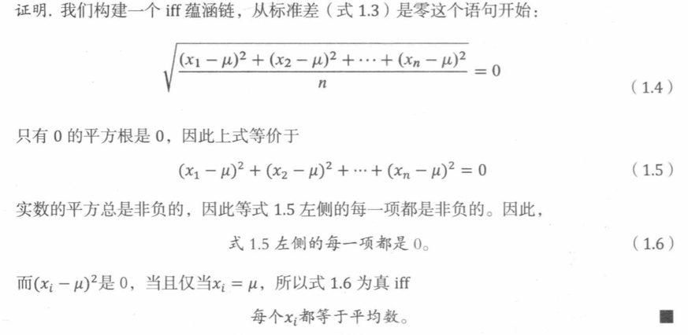

## 

**Theorem.** Every collection of 6 people includes a club of 3 people or a group of 3 strangers.

---

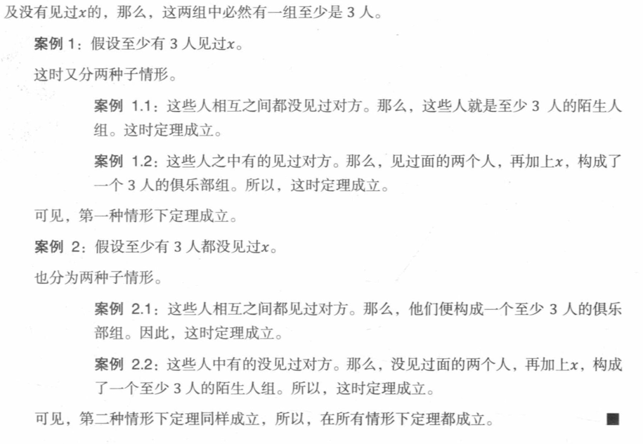

## 

**Theorem 1.8.1.** $\sqrt{2}$ is irrational.

---

**Proof.** We use proof by contradiction. Suppose the claim is false, and $\sqrt{2}$ is rational. Then we can write $\sqrt{2}$ as a fraction $n / d$ in lowest terms.

Squaring both sides gives $2=n^{2} / d^{2}$ and so $2 d^{2}=n^{2}$. This implies that $n$ is a multiple of 2 (see Problems $1.15$ and 1.16). Therefore $n^{2}$ must be a multiple of 4 . But since $2 d^{2}=n^{2}$, we know $2 d^{2}$ is a multiple of 4 and so $d^{2}$ is a multiple of $2 .$ This implies that $d$ is a multiple of 2 .

So, the numerator and denominator have 2 as a common factor, which contradicts the fact that $n / d$ is in lowest terms. Thus, $\sqrt{2}$ must be irrational.

## 

### Group 1

#### 

**Problem 1.8.**
Prove by cases that
$$
max(r, s)+min(r, s)=r+s
$$
for all real numbers $r, s$

---

$Proof.$    The proof is by case analysis. Suppose  $r$ and $s$ are real  numbers. There are three cases:

1. $r>s$

2. $r<s$

3. $r=s$

**Case 1:** Suppose $r>s$, this implies that $max(r, s)=r$ and $min(r, s)=s$. Then,$max(r, s)+min(r, s)=r+s$.Thus, the proposition holds in this case.

**Case 2:** Suppose $r<s$, this implies that $max(r, s)=s$ and $min(r, s)=r$. Then,$max(r, s)+min(r, s)=r+s$. So the proposition holds in this case.

**Case 3:** If $r=s$, this implies that $max(r, s)=min(r, s) =r =s $ . Then,$max(r, s)+min(r, s)=r+s$. So the proposition holds in this case.

This implies that the proposition  holds all cases.

证：采用案例证明法证明。假设 $r$ 和 $s$都是实数，存在以下三种情形：

1. $r>s$
2. $r<s$
3. $r=s$

**情形1**：假设$r>s$​，这表明了 $max(r, s)=r$ , $min(r, s)=s$. 那么$max(r, s)+min(r, s)=r+s$.

​			   此时，命题成立。

**情形2：** 假设 $r<s$, 这表明了 $max(r, s)=s$ , $min(r, s)=r$. 那么,$max(r, s)+min(r, s)=r+s$.

​			   此时，命题成立。

**情形 3:**   假设 $r=s$, 这表明了 $max(r, s)=min(r, s) =r =s $ . 那么$max(r, s)+min(r, s)=r+s$.

​			   此时，命题成立。

 所以，在所有情形下，命题都成立。

#### 

**Problem 1.14.**

Prove that if $a・b=n$, then either $a$ or $b$ must be $≤\sqrt n$, where $a,b$, and $n$ are nonnegative real numbers.

证明:如果$a・b=n$,那么a或b一定有一个满足$≤\sqrt n$,其中a,b,n是非负实数。

---

$Proof.$ We used proof by contradiction. Suppose the claim is false, and  if $a・b=n$, then both $a$ and $b$ must be $＞\sqrt n$.

​	Due to the limitation that $a,b$, and $n$ are nonnegative real numbers, we get  $a・b ＞ \sqrt n・\sqrt n=n$, which contradicts the supposition that $a・b=n$ . Thus, if $a・b=n$, then either $a$ or $b$ must be $≤\sqrt n$.

我们用反证法证明,假设命题是假的,即如果$a·b=n$,那么$a$和$b$必定$＞\sqrt n $

由于$a$,$b$和 $n$ 都是非负实数，则$a・b ＞ \sqrt n・\sqrt n=n$,这与假设$a・b=n$相矛盾。

因此当$a・b=n$,那么a或b一定有一个满足$≤\sqrt n$

### Group 2

#### 

**Problem $1.10$.**
Prove by cases that
$$
|r+s| \leq|r|+|s|
$$
for all real numbers $r, s$

---

证：采用案例证明法证明。假设 $r$ 和 $s$都是实数，存在以下三种情形：

1. $r+s≥0$
2. $r+s<0$

**情形1**：假设$r+s≥0$，这表明了$|r+s|=r+s$,那么$|r|+|s|≥r+s=|r+s|$

​			  此时，命题成立。

**情形2：** 假设$r+s<0$，这表明了$|r+s|=-(r+s)$,

​			   那么$|r|+|s|≥(-r)+(-s)=-(r+s)=|r+s|$

​			   此时，命题成立。

 所以，在所以情形下，命题都成立。

#### 

**Problem $1.15 .$**
Let $n$ be a nonnegative integer.
(a) Explain why if $n^{2}$ is even-that is, a multiple of 2 -then $n$ is even.
(b) Explain why if $n^{2}$ is a multiple of 3 , then $n$ must be a multiple of $3 .$*

n是非负整数,

- (a)解释:如果$n^{2}$ 是偶数——即是2的倍数——那么n是偶数。 

- (b)解释:如果$n^{2}$ 是3的倍数,那么$n$一定是3的倍数。

---

- (a)我们用反证法证明,假设命题是假的,即假设$n^{2}$ 是偶数,则$n$是奇数.则$n$可以表示成$n=2k+1$($k$为整数).
  $$
  \begin{aligned}  
  n^2 & = (2k+1)^2   \\
  &=4k^2+1+4k  \\
  &=4(k^2+k)+1  \\
  &=2×2(k^2+k)+1  \\
  \end{aligned}
  $$
  由于$2×2(k^2+k)$是偶数，则$2×2(k^2+k)+1$是奇数，这与假设$n^{2}$ 是偶数相矛盾。

  因此如果$n^{2}$ 是偶数，那么n是偶数。 

- (b)我们用反证法证明,假设命题是假的,即假设$n^{2}$ 是3的倍数,则$n$不是3的倍数。则$n$可以表示成$n=3k+1$($k$为整数).

  $$
  \begin{aligned}  
  n^2 & = (3k+1)^2   \\
  &=9k^2+1+6k  \\
  &=3(3k^2+2k)+1  \\
  
  \end{aligned}
  $$
  由于$3(3k^2+2k)$是3的倍数，但$3(3k^2+2k)+1$不是3的倍数，这与假设$n^{2}$ 是3的倍数相矛盾。
  

因此如果$n^{2}$ 是3的倍数,那么$n$一定是3的倍数。

# The Well Ordering Principle

*Every nonempty set of nonnegative integers has a smallest element*

*非负整数集中的每个非空子集都有一个最小元素。*

## 

**Theorem $2.2 .1 .$**
$$
1+2+3+\cdots+n=n(n+1) / 2
$$
for all nonnegative integers $n$.

----

**Proof.** By contradiction.  Let's collect them in a set:
$$
C::=\left\{n \in \mathbb{N} \mid 1+2+3+\cdots+n \neq \frac{n(n+1)}{2}\right\}
$$
Assuming there are counterexamples. So, by WOP, $C$ has a minimum element, which we'll call $c$. 

Since $c$ is the smallest counterexample, we know that (2.1) is false for $n=c$ but true for all nonnegative integers $n<c$. 

This means $c-1$ is a nonnegative integer, and since it is less than $c$, equation (2.1) is true for $c-1$. That is,
$$
1+2+3+\cdots+(c-1)=\frac{(c-1) c}{2}
$$
But then, adding $c$ to both sides, we get
$$
1+2+3+\cdots+(c-1)+c=\frac{(c-1) c}{2}+c=\frac{c^{2}-c+2 c}{2}=\frac{c(c+1)}{2}
$$
which means that (2.1) does hold for $c$, after all! This is a contradiction, and we are done.

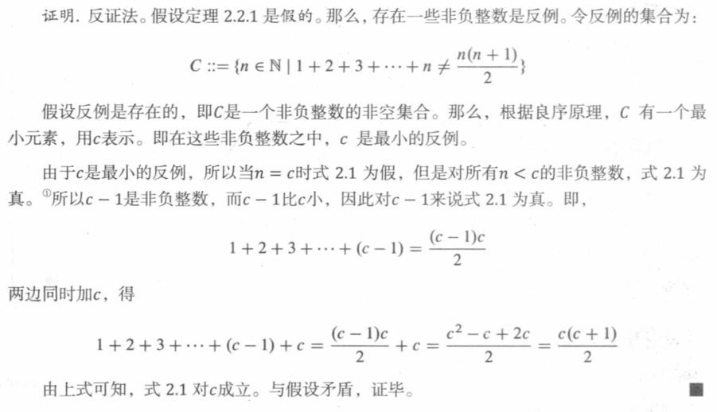

## 

**Theorem 2.3.1.** Every positive integer greater than one can be factored as a pro uct of primes

每一个大于1的整数都能被分解成质因数的乘积。

---

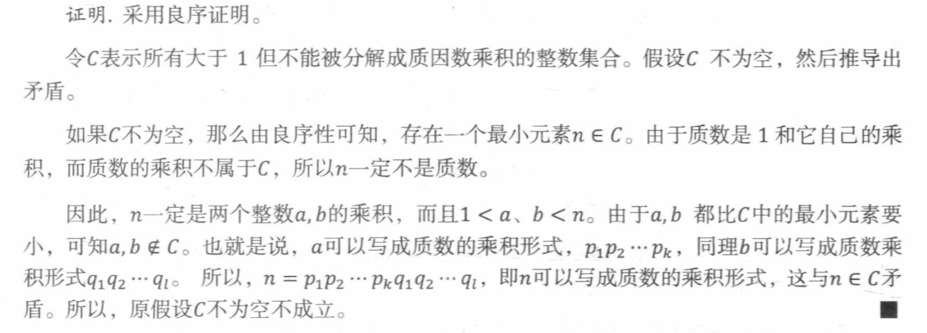

## 

**Theorem 2.4.1.** For any nonnegative integer n the set of integers greater than or equal to-n is well ordered.

对任意非负整数n,大于等于-n的整数构成的集合是良序的。

---

## 

###Group 1 

####  

**Problem 2.7.**

*Use the Well Ordering Principle to prove that any integer greater than or equal to 8 can be represented as the sum of nonnegative integer multiples of 3 and 5.*

使用良序原理证明:任意大于等于8的整数,都可以表示为3和5的非负整数倍的和。

---

$Proof.$  Let $S(n)$ for all integer $n≥8$, exists $x,y$ such that $n=3x+5y$

By contradiction. Assume that $S(n)$ is false. Then, some  integers serve as counterexamples to it. The collection of counterexamples is:
$$
D::=\left\{n \in \mathbb{N}, n≥8 \mid NOT(S(n))\right\}
$$
Assuming  $D$  is a nonempty set of  integers. Then, by the Well Ordering Principle, $D$ has a minimum element, which we can call $d$.  And $d$ is the smallest counterexample among the integers. 

Since $d$ is the smallest counterexample, we know $d$ will not equal to $3x+5y$  for any integer $x,y$.

Then, We can check $S(8), S(9), S(10)$ are holds.So $d$ must be greater than 10 to be a counterexample. But then,  $S(d-3)$ is greater than or equal to 8 and less than $d$, so $S(d-3)$ is hold.

So. exists $x_0,y_0$​ such that 
$$
d-3=3x_0+5y_0 
$$
$$
d=3(x_0+1) + 5y_0
$$

which means this $S(n)$ does hold for $d$, after all. Thus,$D$ is in empty, and we are done.

证明：令 $S(n) =n$对于所有整数$n≥8$，存在 $x,y$ 使得 $S(n)=3x+5y$

反证法。假设命题$S(n)$是假的，那么存在非负整数是反例。
$$
D::=\left\{n \in \mathbb{N}, n≥8 \mid NOT(S(n))\right\}
$$
如果$D$不为空，根据良序定理，$D$中存在一个最小元素的$d$是最小的反例。所以对于任何的整数，$d ≠ 3x+5y$.

接下来，我们确认 $S(8), S(9), S(10)$均成立，因此$d$必须大于10。那么$S(d-3)$ 大于等于 8 小于 $d$, 因此 $S(d-3)$ 成立。

因此存在$x_0,y_0$，使得
$$
d-3=3x_0+5y_0 
$$
$$
d=3(x_0+1) + 5y_0
$$

这表明$S(n)$对d成立，与假设矛盾，证毕。

####  

**Problem 2.15.**
*We'll use the Well Ordering Principle to prove that for every positive integer $n$, the sum of the first $n$ odd numbers is $n^{2}$, that is,*
$$
\sum_{i=0}^{n-1}(2 i+1)=n^{2}
$$
*for all $n>0$.*

使用良序原理证明:对任意正整数n,前n个奇数之和为$n^{2}$,即

$$
\sum_{i=0}^{n-1}(2 i+1)=n^{2}
$$

对所有n>0成立。

$Proof.$    By contradiction. Assume that this theorem is false. Then, some positive integers serve as counterexamples to it. The collection of counterexamples is:
$$
M::=\left\{n \in \mathbb{N^*} \mid \sum_{i=0}^{n-1}(2 i+1) \neq n^{2} \right\}
$$
Assuming  $M$  is a nonempty set of postive integers. Then, by the Well Ordering Principle, $M$ has a minimum element, which we can call $m$.  And $m$ is the smallest counterexample among the postive integers. 

Since $m$ is the smallest counterexample, we know the theorem is false for $n=m$ but true for all postive integers $n<m$. But the theorem  is true for $n=1$, so $m>1$.Thus, $m≥2$. This  means $m-1$ is a positive integer. That is,
$$
\sum_{i=0}^{m-1}(2 (i-1))+1)=(m-1)^{2}
$$
But then, adding $2m-1$ to both sides, we get
$$
\sum_{i=0}^{m}(2 (i-1))+1)=(m-1)^{2}+2m-1=m^2
$$
which means this theorem does hold for $m$, after all. This is a contradiction, and we are done.

证明：反证法。假设命题是假的，那么存在非负整数是反例。
$$
M::=\left\{n \in \mathbb{N^*} \mid \sum_{i=0}^{n-1}(2 i+1) \neq n^{2} \right\}
$$
如果$M$不为空，根据良序定理，$M$中存在一个最小元素$m$是最小的反例。所以当$m =n$时，原命题为假；当$n<m$时，原命题为真。因此对于$m-1$ ，原命题为真。

又因为$n=1$时，原命题成立，因此$m≥2$。那么 $m-1$ 是正整数，因此
$$
\sum_{i=0}^{m-1}(2 (i-1))+1)=(m-1)^{2}
$$
两边同时加上$2m-1$，得
$$
\sum_{i=0}^{m}(2 (i-1))+1)=(m-1)^{2}+2m-1=m^2
$$
这表明原命题对n成立，与假设矛盾，证毕。

### Group 2

#### 

**Problem 2.8.**
Use the Well Ordering Principle to prove that any integer greater than or equal to 50 can be represented as the sum of nonnegative integer multiples of 7,11 , and 13 .

使用良序原理证明:任意大于等于50的整数,都可以表示为7,11和13的非负整数倍的和

---

证明：令 $S(n) =n$对于所有整数$n≥50$，存在 $x,y$ 使得 $S(n)=7x+11y+13z$

反证法。假设命题$S(n)$是假的，那么存在非负整数是反例。
$$
D::=\left\{n \in \mathbb{N}, n≥50 \mid NOT(S(n))\right\}
$$
如果$D$不为空，根据良序定理，$D$中存在一个最小元素的$d$是最小的反例。所以对于任何的整数，$d ≠ 7x+11y+13z$.

接下来，我们确认 $S(50), S(51),...,S(56)$均成立，因此$d$必须大于56。那么$S(d-7)$ 大于等于 50 小于 $d$, 因此 $S(d-7)$ 成立。

因此存在$x_0,y_0,z_0$，使得
$$
d-7=7x_0+11y_0+13z_0 \\ d=7(x_0+1)+11y_0+13z_0
$$
这表明$S(n)$对d成立，与假设矛盾，证毕。

#### 

**Problem 2.18.**
Use the Well Ordering Principle to prove that
$$
1 \cdot 2+2 \cdot 3+3 \cdot 4+\cdots+n(n+1)=\frac{n(n+1)(n+2)}{3}
$$
for all integers $n \geq 1$

---

证明：反证法。假设命题是假的，那么存在非负整数是反例。
$$
M::=\left\{n \geq 1 \mid 1 \cdot 2+2 \cdot 3+3 \cdot 4+\cdots+n(n+1)≠\frac{n(n+1)(n+2)}{3} \right\}
$$
如果$M$不为空，根据良序定理，$M$中存在一个最小元素$m$是最小的反例。所以当$m =n$时，原命题为假；当$n<m$时，原命题为真。因此对于$m-1$ ，原命题为真，即
$$
1 \cdot 2+2 \cdot 3+3 \cdot 4+\cdots+m(m-1)=\frac{m(n-1)(n+1)}{3}
$$
两边同时加上$m(m+1)$，得
$$
1 \cdot 2+2 \cdot 3+3 \cdot 4+\cdots+m(m-1)+m(m+1)\\=\frac{m(n-1)(n+1)}{3}+m(m+1)\\
=\frac{n(n+1)(n+2)}{3}
$$
这表明原命题对n成立，与假设矛盾，证毕。

# Logical Formulas

##  

Truth Table Calculation:
$$
A\ OR\ (NOT(A)\ AND\ B), A\ OR\ B
$$

---

##  

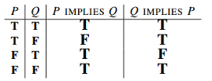

##  

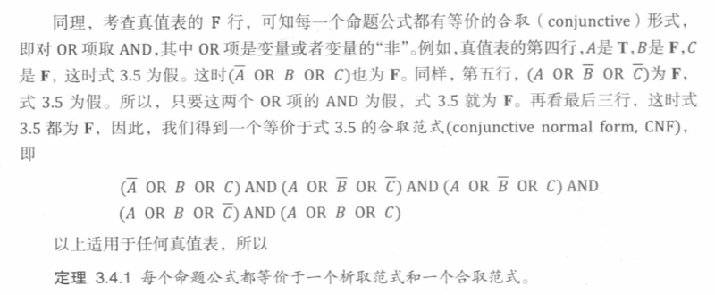

##  

$$
NOT((A\ AND\ B) \ OR\ (A\ AND\ C))
$$

into a full DNF  转换成析取范式

---

$$
\operatorname{NOT}(A \text { AND } B) \longleftrightarrow \bar{A} \text { OR } \bar{B} \quad \text { (AND 的德摩根律) }  \\

NOT (A\ OR\ B) \longleftrightarrow \bar{A}\ AND\ \bar{B} \quad (OR 的德摩根律)\\
(A \text { AND } B) \text { AND } C \longleftrightarrow A \text { AND }(B \text { AND } C) \text { (AND 的结合律)  }\\
A \text { AND }(B \text { OR } C) \longleftrightarrow(A \text { AND } B) \text { OR ( } A \text { AND } C) \text { (AND 对 OR 的分配律 ) }\\
A \text { OR } \bar{A} \longleftrightarrow \mathbf{T} \quad \text { (OR 的永真律) }
$$

##  

### Group 1 

#### 

**Problem 3.11.**

Show truth tables that verify the equivalence of the following two propositional formulas
$$
𝑃\ 𝑋𝑂𝑅\ ( 𝑄 ) , 𝑁𝑂𝑇 (𝑃\ 𝐼𝐹𝐹\ 𝑄 )
$$

---

#### 

**Problem 3.12.**

Prove that the propositional formulas
$$
𝑃 \ 𝑂𝑅 \ \ 𝑄\ 𝑂𝑅\ 𝑅
$$
 And

are equivalent.

---

#### 

**Problem 3.13.**

Prove by truth table that OR distributes over AND, namely,

---

####    

**Problem 3.21.**

Use the equivalence axioms of Section 3.4.2 to convert the formula
$$
𝐴 \ \ 𝑋𝑂𝑅\ \ 𝐵\ 𝑋𝑂𝑅\ \  𝐶
$$
a)   .. to disjunctive (OR of AND’S) form, 

b)   .. to conjunctive (AND of OR’S) form.

---

- a)

Using

$$\text{A\ }\text{XOR}\ B \Leftrightarrow (A\ \text{AND}\ \overline{B})\ \text{OR}\ (\overline{A}\ \text{AND}\ B)$$

We have

$$\lbrack\ (\text{A\ }\text{XOR}\ B) \text{AND}\ \overline{C}\rbrack\ \text{OR}\ \lbrack\ \text{NOT}\ (\text{A\ }\text{XOR}\ B)\ \text{AND}\ C\rbrack$$

And,

1. $$\text{A\ }\text{XOR}\ B \Leftrightarrow (A\ \text{AND}\ \overline{B})\ \text{OR}\ (\overline{A}\ \text{AND}\ B) $$

2. $$
   \text{NOT}\ (\text{A\ }\text{XOR}\ B)\Leftrightarrow \text{NOT}\ ((A\ \text{AND}\ \overline{B})\ \text{OR}\ (\overline{A}\ \text{AND}\ B)) \\ \Leftrightarrow \text{NOT}\ (A\ \text{AND}\ \overline{B})\ \text{AND}\text{\:\:}\text{NOT}\ (\overline{A}\ \text{AND}\ B))\ \\ \Leftrightarrow (\overline{A}\ \text{OR}\ B)\ \text{AND}\ (A\ \text{OR}\ \overline{B})\
   $$

   

which becomes,

$$\lbrack((A\ \text{AND}\ \overline{B})\ \text{OR}\ (\overline{A}\ \text{AND}\ B))\ \text{AND}\ \overline{C}\rbrack\ \text{OR}\ \lbrack((\overline{A}\ \text{OR}\ B)\ \text{AND}\ (A\ \text{OR}\ \overline{B}))\ \text{AND}\ C\rbrack$$

$$\lbrack((A\ \text{AND}\ \overline{B}\ \text{AND}\ \overline{C})\ \text{OR}\ (\overline{A}\ \text{AND}\text{\:B\:}\text{AND}\ \overline{C}))\rbrack\ \text{OR}\ \lbrack((\overline{A}\ \text{OR}\ B)\ \text{AND}\ (A\ \text{OR}\ \overline{B}))\ \text{AND}\ C\rbrack$$

And,

3. $$((\overline{A}\ \text{OR}\ B)\ \text{AND}\ (A\ \text{OR}\ \overline{B})) \Leftrightarrow (\overline{A}\ \text{AND}\ (A\ \text{OR}\ \overline{B}))\ \text{OR}\ (B\ \text{AND}\ (A\ \text{OR}\ \overline{B})) \Leftrightarrow (\overline{A}\ \text{AND}\ \overline{B})\ \text{OR}\ (A\ \text{AND}\ B)$$

which becomes,

$$\lbrack((A\ \text{AND}\ \overline{B}\ \text{AND}\ \overline{C})\ \text{OR}\ (\overline{A}\ \text{AND}\text{\:B\:}\text{AND}\ \overline{C}))\rbrack\ \text{OR}\ \lbrack((\overline{A}\ \text{AND}\ \overline{B})\ \text{OR}\ (A\ \text{AND}\ B))\ \text{AND}\ C\rbrack$$

$$\lbrack((A\ \text{AND}\ \overline{B}\ \text{AND}\ \overline{C})\ \text{OR}\ (\overline{A}\ \text{AND}\text{\:B\:}\text{AND}\ \overline{C}))\rbrack\ \text{OR}\ \lbrack((\overline{A}\ \text{AND}\ \overline{B}\ \text{AND}\ C)\ \text{OR}\ (A\ \text{AND}\text{\:B\:}\text{AND}\ C))\rbrack$$

$$(A\ \text{AND}\ \overline{B}\ \text{AND}\ \overline{C})\ \text{OR}\ (\overline{A}\ \text{AND}\text{\:B\:}\text{AND}\ \overline{C})\ \text{OR}\ (\overline{A}\ \text{AND}\ \overline{B}\ \text{AND}\ C)\ \text{OR}\ (A\ \text{AND}\text{\:B\:}\text{AND}\ C)$$

- b)   

Using

$$A \oplus B \Leftrightarrow (A\ \text{OR}\ B)\ \text{AND}\ (\overline{A}\ \text{OR}\ \overline{B})$$

We have

$$\lbrack\ (\text{A\ }\text{XOR}\ B) \text{OR}\ {C}\rbrack\ \text{AND}\ \lbrack\ \text{NOT}\ (\text{A\ }\text{XOR}\ B)\ \text{OR}\ \overline{C}\rbrack$$

And,

1. $$A \oplus B \Leftrightarrow (A\ \text{OR}\ B)\ \text{AND}\ (\overline{A}\ \text{OR}\ \overline{B})$$

2. $$
   \text{NOT}\ (\text{A\ }\text{XOR}\ B)\Leftrightarrow \text{NOT}\ ((A\ \text{OR}\ B)\ \text{AND}\ (\overline{A}\ \text{OR}\ \overline{B})) \\ \Leftrightarrow \text{NOT}\ (A\ \text{OR}\ {B})\ \text{OR}\text{\:\:}\text{NOT}\ (\overline{A}\ \text{OR}\ \overline{B}))\ \\ \Leftrightarrow (\overline{A}\ \text{AND}\ \overline{B})\ \text{OR}\ (A\ \text{AND}\ {B})\
   $$

   

which becomes,

$$\lbrack\ ((A\ \text{OR}\ B)\ \text{AND}\ (\overline{A}\ \text{OR}\ \overline{B})) \text{OR}\ {C}\rbrack\ \text{AND}\ \lbrack\ ((\overline{A}\ \text{AND}\ \overline{B})\ \text{OR}\ (A\ \text{AND}\ {B}))\ \text{OR}\ \overline{C}\rbrack$$

$$\lbrack\ (A\ \text{OR}\ B \ \text{OR}\ {C})\ \text{AND}\ (\overline{A}\ \text{OR}\ \overline{B} \ \text{OR}\ {C}) \rbrack\ \text{AND}\ \lbrack\ ((\overline{A}\ \text{AND}\ \overline{B})\ \text{OR}\ (A\ \text{AND}\ {B}))\ \text{OR}\ \overline{C}\rbrack$$

And,

3. $$ (\overline{A}\ \text{AND}\ \overline{B})\ \text{OR}\ (A\ \text{AND}\ {B}) \Leftrightarrow [\overline{A}\  \text{OR}\ (A\ \text{AND}\ {B})]\  \text{AND}\ [\overline{B} \ \text{OR}\ (A\ \text{AND}\ {B})]  \\ \Leftrightarrow 
   (\overline{A} \ \text{OR}\ {B})\  \text{AND}\  (\overline{B} \ \text{OR}\ {A}) $$

which becomes,

$$ \lbrack\ (A\ \text{OR}\ B \ \text{OR}\ {C})\ \text{AND}\ (\overline{A}\ \text{OR}\ \overline{B} \ \text{OR}\ {C}) \rbrack\ \text{AND}\ \lbrack\ ((\overline{A} \ \text{OR}\ {B})\  \text{AND}\  (\overline{B} \ \text{OR}\ {A}))\ \text{OR}\ \overline{C}\rbrack$$ 

$$ \ (A\ \text{OR}\ B \ \text{OR}\ {C})\ \text{AND}\ (\overline{A}\ \text{OR}\ \overline{B} \ \text{OR}\ {C})\ \text{AND}\ \ (\overline{A} \ \text{OR}\ {B} \ \text{OR}\ \overline{C})\  \text{AND}\  ({A} \ \text{OR}\ \overline{B} \ \text{OR}\ \overline{C})\ $$ 

####  

**Problem 3.25.**
Let $Q(x, y)$ be the statement $" x$ has been a contestant on television show $y . "$
The universe of discourse for $x$ is the set of all students at your school and for $y$ is the set of all quiz shows that have ever been on television.

Determine whether or not each of the following expressions is logically equivalent to the sentence:

"No student at your school has ever been a contestant on a television quiz show."
(a) $\forall x \forall y$. $\operatorname{NOT}(Q(x, y))$
(b) $\exists x \exists y . \operatorname{NOT}(Q(x, y))$
(c) $\operatorname{NOT}(\forall x \forall y, Q(x, y))$
(d) $\operatorname{NOT}(\exists x \exists y, Q(x, y))$

---

# Mathematical Data Types

##  

$$
x \in A \cup B \text { IFF } x \in A \text { OR } x \in B
$$
$$
x \in A \cap B \text { IFF } x \in A \text { AND } x \in B
$$
$$
x \in A-B \text { IFF } x \in A \text { AND } x \notin B
$$
$$
\bar{A}=\emptyset \operatorname{IFF} A=D
$$
$$
\overline{\mathbb{N}}=\mathbb{Z}^{-}
$$
$$
A \subseteq B \text { 等价于 } A \cap \bar{B}=\varnothing
$$
$$
B \in \operatorname{pow}(A) \text { IFF } B \subseteq A
$$

##  

**Theorem 4.1.2. **[Distributive Law for Sets] Let $A, B$ and $C$ be sets. Then:
$$
A \cap(B \cup C)=(A \cap B) \cup(A \cap C)
$$
集合的分配律

---

**Proof.** The equality (4.1) is equivalent to the assertion that
$$
z \in A \cap(B \cup C) \quad \text { iff } \quad z \in(A \cap B) \cup(A \cap C)
$$
for all $z$. Now we'll prove (4.2) by a chain of iff's.
Now we have
$z \in A \cap(B \cup C)$
		iff $(z \in A)$ AND $(z \in B \cup C)$
		iff $(z \in A)$ AND $(z \in B$  OR $z \in C)$
		iff $(z \in A$ AND $z \in B)$ OR $(z \in A$ AND $z \in C) \quad$
		iff $(z \in A \cap B)$ OR $(z \in A \cap C)$
		iff $z \in(A \cap B) \cup(A \cap C)$

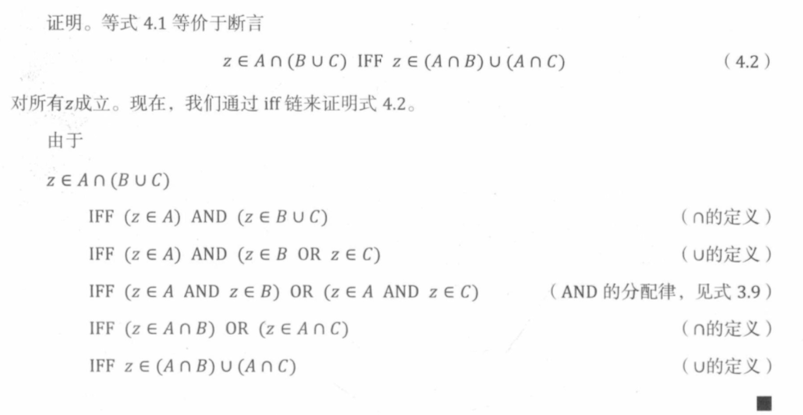

## 

### Group 1

#### 

**Problem 4.3.**

​	**(a)** *Verify that the propositional formula $(P$ AND $\bar{Q})$ OR $(P$ AND $Q)$ is equivalent to $P$.*证明命题公式与P等价。
​	**(b)** *Prove that*
$$
A=(A-B) \cup(A \cap B)
$$
​	*for all sets, $A, B$, by showing*
$$
x \in A \text { IFF } x \in(A-B) \cup(A \cap B)
$$
​	*for all elements $x$ using the equivalence of part (a) in a chain of IFF's.*

---

- **(a)** 

  ​	$Proof.$  The equality  is equivalent to the assertion that  该等式等价于断言对于所有$x$都成立

$$
x \in (P \text { AND } \bar{Q}) \text { OR } (P \text { AND } {Q}) \text { iff } x \in P
$$

​			for all $x$. Now we'll prove by a chain of iff's.
​			Now we have
$$
\begin{aligned} x &
\in (P \text { AND } \bar{Q}) \text { OR } (P \text { AND } {Q}) &  \\
&\text { iff } x\in (P \text { OR } (P \text { AND } {Q})) \text { AND } (\bar{Q} \text { OR } {(P \text { AND } {Q})}) &  \\
&\text { iff } x\in (P \text { AND } {Q} ) \text { AND } ((\bar{Q} \text { AND } P) \text{OR}(\bar{Q} \text { AND } Q))&  \\
&\text { iff } x\in (P \text { AND } {Q} ) \text { AND } (\bar{Q} \text { AND } P) &  \\
&\text { iff } x\in P \text { AND } ( {Q} \text { AND } \bar{Q}) &  \\
&\text { iff } x\in P  &  \\
\end{aligned}
$$

- **(b)** 

  ​	$Proof.$  The equality  is equivalent to the assertion that

$$
x \in A \text { iff } x \in(A-B) \cup(A \cap B)
$$

​			for all $x$. Now we'll prove by a chain of iff's.
​			Now we have
$$
\begin{aligned} x &
\in(A-B) \cup(A \cap B) &  \\
&\text { iff }  (x \in A-B) \text { OR }(x \in A \cap B)  &  \\
&\text { iff }  (x \in A \text { AND } x\notin B) \text { OR }(x \in A \text { AND } x\in B)  &  \\
&\text { iff }  (x \in A \text { OR } (x \in A \text { AND } x\in B)) \text { AND }(x \notin B \text { OR } (x \in A \text { AND } x\in B))  &  \\
&\text { iff }  (x \in A \text { AND } (x \in A \text { OR } x\in B)) \text { AND }(x \notin B \text { OR } x \in A )  &  \\
&\text { iff }  x \in A \text { AND } (x \in A \text { OR } (x\in B \text{ AND } x \notin B)) &  \\
&\text { iff }  x \in A \text { AND } (x \in A  ) &  \\
&\text { iff }  x \in A &  \\
\end{aligned}
$$

#### 

**Problem 4.5.**
*Prove De Morgan's Law for set equality*
$$
\overline{A \cap B}=\bar{A} \cup \bar{B}
$$
*by showing with a chain of IFF's that $x \in$ the left-hand side of $(4.9)$ iff $x \in$ the right-hand side. You may assume the propositional version (3.14) of De Morgan's Law.*

通过$iff$链证明x∈等式4.9左边的部分,当且仅当x∈等式4.9右边的部分。假设式3.14的德摩根定律同样适用于命题。

---

$$
\operatorname{NOT}(A \text { AND } B) \longleftrightarrow \bar{A} \text { OR } \bar{B} \quad \text { (De Morgan for AND) }(3.14)
$$

- $Proof.$  The equality  is equivalent to the assertion that

$$
x \in \overline{A \cap B} \text { iff } x \in \bar{A} \cup \bar{B}
$$

​			for all $x$. Now we'll prove by a chain of iff's.
​			Now we have
$$
\begin{aligned} x &
\in{\overline{A \cap B}} & \\
&\text { iff }  (x \notin A \cap B)  &  \\
&\text { iff }  (x \notin {A}  \text{ OR }  x \notin {B})  &    (De\ Morgan\ for\ AND(3.14))\\
&\text { iff }  (x \in \overline{A}  \text{ OR }  x \in \overline{B})  &  \\
&\text { iff }  ( \overline{A}  \cup   \overline{B})  &  \\

\end{aligned}
$$

#### 

**Problem 4.6.**
*Powerset Properties.
	Let $A$ and $B$ be sets.*
	**(a)** *Prove that*
$$
\text{pow}(A \cap B)=\text{pow}(A) \cap \text{pow}(B)
$$
​	**(b)** *Prove that*
$$
(\text{pow}(A) \cup \text{pow}(B)) \subseteq \text{pow}(A \cup B)
$$
​	*with equality holding iff one of $A$ or $B$ is a subset of the other.*

​	当且仅当A,B中任意一个是另一个的子集。

- **(a)** 

  ​		$Proof.$  The equality  is equivalent to the assertion that

$$
x \in \text{pow}(A \cap B) \text { iff } x \in \text{pow}(A) \cap \text{pow}(B)
$$

​					for all $x$. Now we'll prove by a chain of iff's.
​					Now we have
$$
\begin{aligned} x &
\in \text{pow}(A \cap B) & \\
&\text { iff }  (x \subseteq A \cap B)  &  \\
&\text { iff }  (x \subseteq A \text{ AND } x \subseteq B)  &  \\
&\text { iff }  (\text{pow}(A) \text{ AND } \text{pow}(B))  &  \\
&\text { iff }  (\text{pow}(A) \cap \text{pow}(B))  &  \\
\end{aligned}
$$

- **(b)** 

  ​			$Proof.$  The equality  is equivalent to the assertion that
  $$
  x \in (\text{pow}(A) \cup \text{pow}(B))  \text { iff } x \in \text{pow}(A \cup B)
  $$
  ​			for all $x$. Now we'll prove by a chain of iff's.
  ​			Now we have
  $$
  \begin{aligned} x &
  \in \text{pow}(A) \cup \text{pow}(B) & \\
  &\text { iff }  x \subseteq A \text{ OR } x \subseteq B  &  \\
  &\text { iff }  x \subseteq A\cup B  \text{ OR } x \subseteq B\cup A  &  \\
  &\text { iff }  x\in \text{pow}(A\cup B) \cup \text{pow}(B\cup A)  &  \\
  &\text { iff }  x\in \text{pow}(A\cup B)  &  \\
  \end{aligned}
  $$

# Induction

## 

**Theorem 5.1.1.**

 For all $n \in \mathbb{N}$,
$$
1+2+3+\cdots+n=\frac{n(n+1)}{2}
$$

---

$Proof.$ 

**Base case**: $P(0)$ is true, because both sides of equation (5.1) equal zero when $n=0$

**Inductive step**:  Assume that $P(n)$ is true, that is equation (5.1) holds for some nonnegative

integer $n$. Then adding $n+1$ to both sides of the equation implies that
$$
\begin{aligned} 1+2+3+\cdots+n+(n+1) &=\frac{n(n+1)}{2}+(n+1) \\ &=\frac{(n+1)(n+2)}{2} \quad \text { (by simple algebra) } \end{aligned}
$$
which proves $P(n+1)$
So it follows by induction that $P(n)$ is true for all nonnegative $n$.

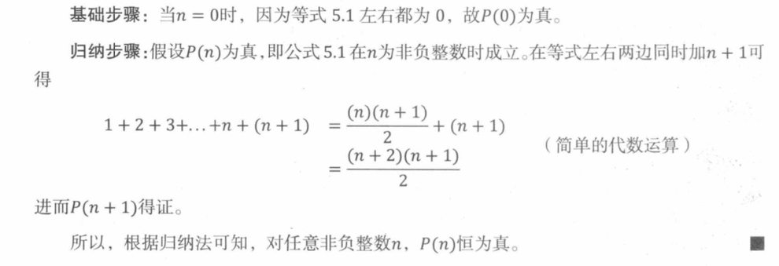

##  

**Theorem 5.1. 2.**

 For all n≥0 there exists a tiling of a $2^n×2^n$ courtyard with Bill n a central square.

对任意n≥0，大小为$2^n×2^n$的庭院，存在某种中间是Bil雕像的铺设方案。

---

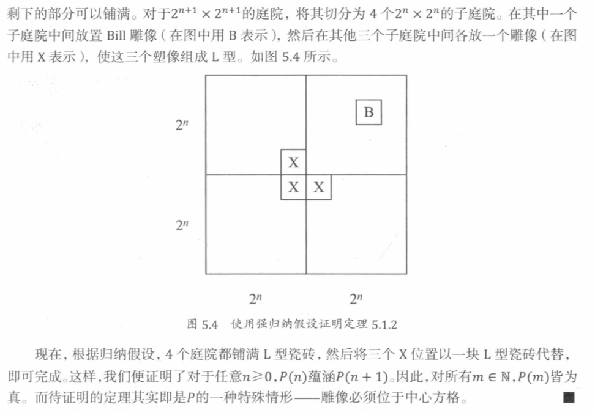

## 

### Group 1

#### 

**Problem 5.4.**
*Prove by induction on $n$ that*
$$
1+r+r^{2}+\cdots+r^{n}=\frac{r^{n+1}-1}{r-1}
$$
*for all $n \in \mathbb{N}$ and numbers $r \neq 1$.*

---

$Proof.$ 

- $P(0)$ is true, because both sides of equation this equal one when $n=0$

- Assume that $P(n)$​ is true, that is equation  holds for some nonnegative integer $n$​. Then adding $r^{n+1}$​ to both sides of the equation implies that
  $$
  \begin{aligned} 1+r+r^{2}+\cdots+r^{n}+r^{n+1} &
  =\frac{r^{n+1}-1}{r-1}+r^{n+1}\\ 
  &=\frac{r^{n+1}-1+r^{n+1}(r-1)}{r-1} \\
  &=\frac{r^{n+1}-1+r^{n+2}-r^{n+1}}{r-1} \\
  &=\frac{r^{n+2}-1}{r-1} \\
  \end{aligned}
  $$
  which proves $P(n+1)$
  So it follows by induction that $P(n)$ is true for all nonnegative $n$​.
  
  **基础步骤**：当$n=0$时，等式左右都为0，故$P(0)$为真。
  
  **归纳步骤**：假设$P(n)$为真，等式左右两边同时加上$r^{n+1}$,得
  $$
  \begin{aligned} 1+r+r^{2}+\cdots+r^{n}+r^{n+1} &
  =\frac{r^{n+1}-1}{r-1}+r^{n+1}\\ 
  &=\frac{r^{n+1}-1+r^{n+1}(r-1)}{r-1} \\
  &=\frac{r^{n+1}-1+r^{n+2}-r^{n+1}}{r-1} \\
  &=\frac{r^{n+2}-1}{r-1} \\
  \end{aligned}
  $$
  进而$P(n+1)$得证。
  
  ​	根据归纳法，对于任何非负整数$n$,且$n≠1$，$P(n)$恒为真。
  
  

#### 

**Problem 5.5.**
*Prove by induction:*
$$
1+\frac{1}{4}+\frac{1}{9}+\cdots+\frac{1}{n^{2}}<2-\frac{1}{n}
$$
*for all $n>1$.*

$Proof.$ 

- $P(2)$ is true, because left side of equation is less than right side  when $n=2$ 
  $$
  1+\frac{1}{4}=\frac{5}{4}<2-\frac{1}{4}=\frac{7}{4}
  $$

- Assume that $P(n)$​ is true, that is equation  holds for some nonnegative integer $n$​. Then adding $\frac{1}{(n+1)^2}$​ to both sides of the equation implies that
  $$
  \begin{aligned} 1+\frac{1}{4}+\frac{1}{9}+\cdots+\frac{1}{n^{2}}+\frac{1}{(n+1)^2} &
  <2-\frac{1}{n}+\frac{1}{(n+1)^2}\\ 
  &=2-\left(\frac{1}{n}-\frac{1}{(n+1)^2} \right)\\
  &=2-\left(\frac{n^2+1+n}{n(n+1)^2} \right)\\
  &=2-\left(\frac{n^2+n}{n(n+1)^2}+\frac{1}{n(n+1)^2} \right)\\
  &=2-\left(\frac{1}{n+1}+\frac{1}{n(n+1)^2} \right)\\
  &=2-\frac{1}{n+1}-\frac{1}{n(n+1)^2} \\
  &<2-\frac{1}{n+1} \\
  \end{aligned}
  $$
  which proves $P(n+1)$

- So it follows by induction that $P(n)$ is true for for all $n>1$.

# State Machines

##  

The Die Hard 3 State Machine

---

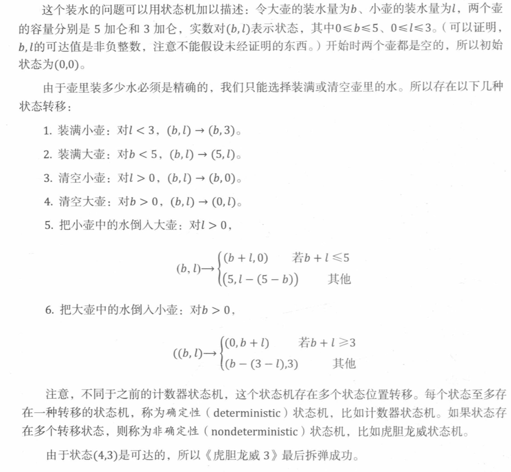

##  

**A Fast Exponentiation Program**
Given inputs $a \in \mathbb{R}, b \in \mathbb{N}$, initialize registers $x, y, z$ to $a, 1, b$ respectively, and repeat the following sequence of steps until termination:

- if $z=0$ return $y$ and terminate
- $r:=$ remainder $(z, 2)$
- $z:=$ quotient $(z, 2)$
- if $r=1$, then $y:=x y$
- $x:=x^{2}$

---

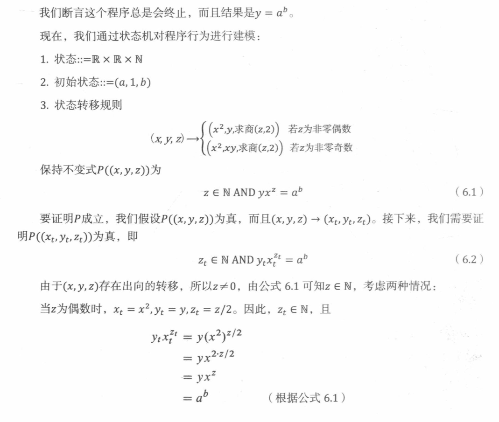

## 

**Problem 6.3.**
A robot named Wall-E wanders around a two-dimensional grid. He starts out at $(0,0)$ and is allowed to take four different types of steps:

1. $(+2,-1)$
2. $(+1,-2)$
3. $(+1,+1)$
4. $(-3,0)$

Thus, for example, Wall-E might walk as follows. The types of his steps are listed above the arrows.
$$
(0,0) \stackrel{1}{\rightarrow}(2,-1) \stackrel{3}{\rightarrow}(3,0) \stackrel{2}{\rightarrow}(4,-2) \stackrel{4}{\rightarrow}(1,-2) \rightarrow \ldots
$$
Wall-E's true love, the fashionable and high-powered robot, Eve, awaits at $(0,2)$.

**(a)** Describe a state machine model of this problem.
**(b)** Will Wall-E ever find his true love? Either find a path from Wall-E to Eve, or use the Invariant Principle to prove that no such path exists.

---

- **(a)** 

  1. states $::=(x,y)$,
  2. start state :: $=(0,0)$,
  3. transitions are defined by the rule

  $$
  (x, y) \longrightarrow \{(x+2, y-1),(x+1,y-2),(x+1,y+1),(x-3,y)|x,y\in\mathbb{N}\}
  $$

- **(b)** 

  ​	$Proof.$ We assume that ( $a, b$ ) can attach from $(0,0)$ by these transitions .So we can get the equation group :

$$
\left\{\begin{array}{c}
2 x_{1}+x_{2}+x_{3}-3 x_{4}=a \\
-x_{1}-2 x_{2}+x_{3}=b
\end{array}\right.
$$
​		We can get the result by the linear algebra:
$$
\left\{\begin{array}{l}
x_{1}=2 k_{1}-k_{2}+\frac{2 a+b}{3} \\
x_{2}=-k_{1}+k_{2}- \frac{a+2 b}{3} \\
x_{3}=k_{2} \\
x_{4}=k_{1}
\end{array}\right.
$$
​		In the result, $k_{2}$ and $k_{1} \in \mathrm{R}$
​		As for every point, we can get by these transitions .But in this situation $x_{1}, \mathrm{x}_{2}, \mathrm{x}_{3}$ and $x_{4}$ are positive integer .So if these don't fit the condition ,the way is not existed .As for $(0,2)$, it don't fit the condition, so we can get the conclusion : Wall-E can't find his true love,

1. 状态$::=(x,y)$,

2. 初始状态 :: $=(0,0)$,

3. 状态转移规则
   $$
   (x, y) \longrightarrow \{(x+2, y-1),(x+1,y-2),(x+1,y+1),(x-3,y)|x,y\in\mathbb{N}\}
   $$
   

证明：我们假设$(a, b )$可以从$(0, 0)$通过转换可以得到以下方程组：

$$
\left\{\begin{array}{c}
2 x_{1}+x_{2}+x_{3}-3 x_{4}=a \\
-x_{1}-2 x_{2}+x_{3}=b
\end{array}\right.
$$
我们可以通过线性代数得到结果：
$$
\left\{\begin{array}{l}
x_{1}=2 k_{1}-k_{2}+\frac{2 a+b}{3} \\
x_{2}=-k_{1}+k_{2}- \frac{a+2 b}{3} \\
x_{3}=k_{2} \\
x_{4}=k_{1}
\end{array}\right.
$$
由于$x_1,x_2,x_3 和 x_4$都是正整数。所以如果这些不符合条件，则该方法不存在。至于(0,2)，它不符合条件，所以我们可以得出结论：Wall - e不能找到它的真爱Eva.

# Recursive Data Types

##  

**Definition 7.1.1. **

Let $A$ be a nonempty set called an alphabet, whose elements are referred to as characters (also called letters, symbols, or digits). The recursive data type $A^{*}$ of strings over alphabet $A$ is defined as follows

---

- Base case: the empty string $\lambda$ is in $A^{*}$.

- Constructor case: If $a \in A$ and $s \in A^{*}$, then the pair $\langle a, s\rangle \in A^{*}$.

  

  

**Definition 7.1.2. **

The length $|s|$ of a string $s$ is defined recursively based on Definition 7.1.1.

---

Base case: $|\lambda|::=0$.
Constructor case: $|\langle a, s\rangle|::=1+|s|$.

**Definition 7.1.3.**

The concatenation $s \cdot t$ of the strings $s, t \in A^{*}$ is defined recursively based on Definition 7.1.1:

---

Base case:
$$
\lambda \cdot t::=t
$$
Constructor case:
$$
\langle a, s\rangle \cdot t::=\langle a, s \cdot t\rangle
$$

##  

**Lemma 7.1.4.**
$$
s \cdot \lambda=s
$$
for all $s \in A^{*}$.

---

Proof. The proof is by structural induction on the recursive definition $7.1 .3$ of concatenation. The induction hypothesis will be
$$
P(s)::=[s \cdot \lambda=s]
$$
Base case: $(s=\lambda)$.
$$
\begin{aligned}
s \cdot \lambda &=\lambda \cdot \lambda \\
&=\lambda \\
&=s
\end{aligned}
$$
Constructor case: $(s=a \cdot t)$​.

$$
\begin{array}{rlr}s \cdot \lambda & =(a \cdot t) \cdot \lambda & \\ & =a \cdot(t \cdot \lambda) & \\ & =a \cdot t & \text { (Constructor case of Def 7.1.3) } \\ & =s & \text { by induction hypothesis } P(t)\end{array}
$$

So $P(s)$ holds. This completes the proof of the constructor case, and we conclude by structural induction that equation (7.1.4) holds for all $s \in A^{*}$​.

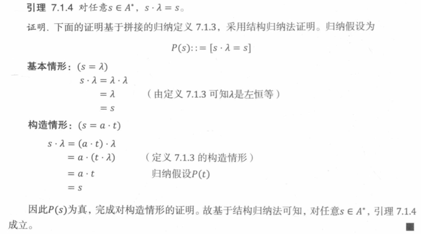

##  

**Lemma.**
$$
|s \cdot t|=|s|+|t|
$$
for all $s, t \in A^{*}$.

---

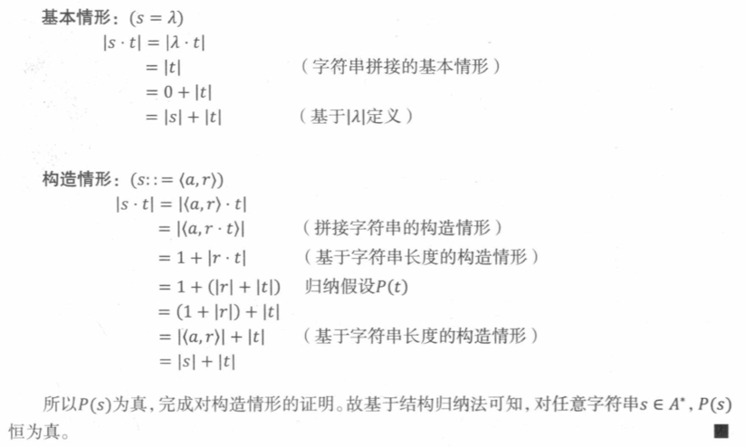

## 

**Problem 7.6.**
Definition. The recursive data type *binary-2PG* of binary trees with **leaf labels $L$ **is defined recursively as follows:

- Base case: $\langle$ leaf, $l\rangle \in$ binary-2PG, for all labels $l \in L$.

- Constructor case: If $G_{1}, G_{2} \in$ binary-2PG, then
  $$
  \left\langle\right. bintree, \left.G_{1}, G_{2}\right\rangle \in\text{ binary-2PG}
  $$
  The size $|G|$ of $G \in$ binary- $2 \mathrm{PG}$​ is defined recursively on this definition by:

- Base case:

$$
\mid\langle\text { leaf, } l\rangle \mid::=1, \quad \text { for all } l \in L
$$

- Constructor case:
  $$
  \mid\left\langle\right. bintree, \left.G_{1}, G_{2}\right\rangle|::=| G_{1}|+| G_{2} \mid+1
  $$
  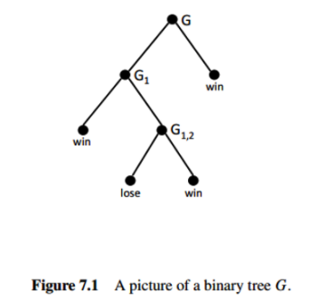

  For example, the size of the *binary-2PG* $G$ pictured in Figure $7.1$, is 7 .

  - **(a) ** Write out (using angle brackets and labels bintree, leaf, etc.) the *binary-2PG* $G$ pictured in Figure 7.1.

    

    ​	The value of flatten $(G)$ for $G \in$ binary-2PG is the sequence of labels in $L$ of the leaves of $G$. For example, for the binary-2PG $G$ pictured in Figure 7.1,

  $$
  \text { flatten }(G)=(\text { win, lose, win, win). }
  $$

  - **(b)**  Give a recursive definition of flatten. (You may use the operation of concatenation (append) of two sequences.)
  - **(c)** Prove by structural induction on the definitions of flatten and size that

  $$
  2 \cdot \text { length(flatten }(G))=|G|+1
  $$

  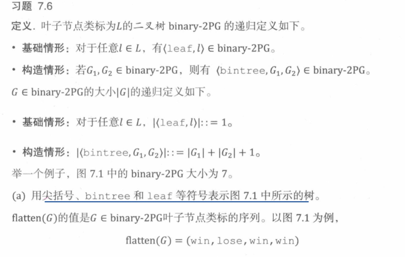

  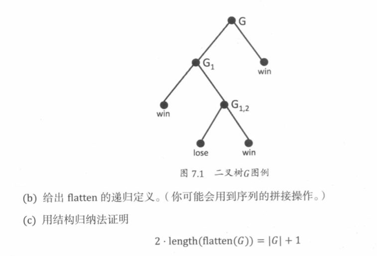

  ---

#Logical Formulas 

## 

**Problem 10.6.**

- **(a)** Give an example of a digraph in which a vertex u is on a positive even-length closed walk,, but no vertex is on an even-length cycle

- **(b)** Give an example of a digraph in which a vertex u is on an odd-length closed walk but not on an odd-length cycl
- **(c)** Prove that every odd-length closed walk contains a vertex that le ngt cycle.

- **(a)**

  

- **(b)**

  

- **(c)**Prove that every odd-length closed walk contains a vertex that le ngt cycle.

  $Proof.$Let 𝐺=(𝑉,𝐸) be a closed walk which is every odd-length.And $G_{1}$ be such a circuit.

  By contradiction. Assume that $G$ is no cycles.Then $G_1$ is not a cycle.

  Hence, there exist a vertex $v_i$ And an integer $k$ such  that $v_i=v_k$ .

  - If $k-i$ is odd, then we have an odd circuit.
  - If $k-i$ is even, then $\left(v_{1}, \ldots, v_{i}, v_{k+1}, \ldots, v_{2 n+1}\right)$ Is an odd circuit.

  This means  each step a circuit whose length is odd is reduced.

  For $n^{th}$ step for some $𝑛∈ℕ$, We knows:

  - $C_n$ is a cycle, which contraduction the supposition.
  - $C_n$ is a circult, which length is 3.

  But then, circult of length 3 is cycle, so $C_n$​ is a cycle, which has odd length.This is a contradiction, and we are done.

  

