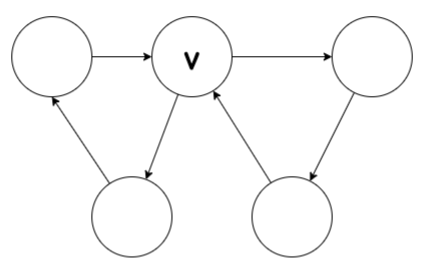

# Group 1

**Problem 7.6.**
Definition. The recursive data type *binary-2PG* of binary trees with **leaf labels $L$ **is defined recursively as follows:

- Base case: $\langle$ leaf, $l\rangle \in$ binary-2PG, for all labels $l \in L$.

- Constructor case: If $G_{1}, G_{2} \in$ binary-2PG, then
  $$
  \left\langle\right. bintree, \left.G_{1}, G_{2}\right\rangle \in\text{ binary-2PG}
  $$
  The size $|G|$ of $G \in$ binary- $2 \mathrm{PG}$​ is defined recursively on this definition by:

- Base case:
$$
\mid\langle\text { leaf, } l\rangle \mid::=1, \quad \text { for all } l \in L
$$
- Constructor case:
  $$
  \mid\left\langle\right. bintree, \left.G_{1}, G_{2}\right\rangle|::=| G_{1}|+| G_{2} \mid+1
  $$
  

  For example, the size of the *binary-2PG* $G$ pictured in Figure $7.1$, is 7 .

  - **(a) ** Write out (using angle brackets and labels bintree, leaf, etc.) the *binary-2PG* $G$ pictured in Figure 7.1.

    
    
    ​	The value of flatten $(G)$ for $G \in$ binary-2PG is the sequence of labels in $L$ of the leaves of $G$. For example, for the binary-2PG $G$ pictured in Figure 7.1,
  
  $$
  \text { flatten }(G)=(\text { win, lose, win, win). }
  $$
  
  - **(b)**  Give a recursive definition of flatten. (You may use the operation of concatenation (append) of two sequences.)
  - **(c)** Prove by structural induction on the definitions of flatten and size that
  
  $$
  2 \cdot \text { length(flatten }(G))=|G|+1
  $$

  

  
  

***

**Problem 10.6.**

- **(a)** Give an example of a digraph in which a vertex u is on a positive even-length closed walk,, but no vertex is on an even-length cycle

- **(b)** Give an example of a digraph in which a vertex u is on an odd-length closed walk but not on an odd-length cycl
- **(c)** Prove that every odd-length closed walk contains a vertex that le ngt cycle.

- **(a)**

  

- **(b)**

  

- **(c)**Prove that every odd-length closed walk contains a vertex that le ngt cycle.

  $Proof.$Let 𝐺=(𝑉,𝐸) be a closed walk which is every odd-length.And $G_{1}$ be such a circuit.

  By contradiction. Assume that $G$ is no cycles.Then $G_1$ is not a cycle.

  Hence, there exist a vertex $v_i$ And an integer $k$ such  that $v_i=v_k$ .

  - If $k-i$ is odd, then we have an odd circuit.
  - If $k-i$ is even, then $\left(v_{1}, \ldots, v_{i}, v_{k+1}, \ldots, v_{2 n+1}\right)$ Is an odd circuit.

  This means  each step a circuit whose length is odd is reduced.

  For $n^{th}$ step for some $𝑛∈ℕ$, We knows:

  - $C_n$ is a cycle, which contraduction the supposition.
  - $C_n$ is a circult, which length is 3.

  But then, circult of length 3 is cycle, so $C_n$​ is a cycle, which has odd length.This is a contradiction, and we are done.

  

  

